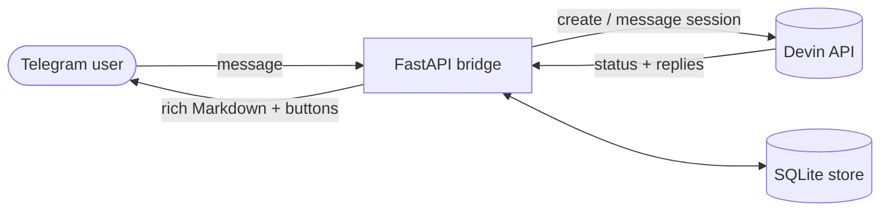

<div align="center">


# Telegram–Devin Bridge

**Run Devin AI sessions from a Telegram chat.**
Each DM or forum topic gets its own Devin session; replies stream back as rich Telegram messages.

[](https://www.python.org/)
[](https://fastapi.tiangolo.com/)
[](https://docs.astral.sh/ruff/)

</div>

---

## Features

- **Session per conversation** — every DM or forum topic maps to an active Devin session, with SQLite history to `/resume` older ones.
- **Rich replies** — Devin's answers arrive as Telegram rich Markdown with inline `OPTIONS:` buttons, PR cards, and image/document attachments.
- **Media in both directions** — photos, documents, voice, audio, and video up to 20 MB are uploaded to Devin; artifacts come back as photos or files.
- **Voice transcription** — Whisper API, faster-whisper, whisper.cpp, an external command, or a bounded Docker sidecar (e.g. Moonshine).
- **Chat-app behavior** — turn debounce, per-user rate limiting, typing indicators and drafts, queued turns while Devin is busy.
- **Access control** — user/chat allowlists, admin approval flow, per-chat free-response mode.
- **Ops built in** — diagnostics endpoint, narrow HTTP admin API, notifications webhook, and `/update` self-updates from Telegram.
- **Deploy anywhere** — webhook behind Tailscale Funnel/HTTPS, or long polling with no public URL at all; OpenRC, systemd, and Fly.io supported.

## How it works



A single FastAPI process receives Telegram updates (webhook or long polling),
creates or resumes the Devin session for that conversation, and a per-session
watcher streams each new `devin_message` back to Telegram while it works.

## Quick start

Requires Python ≥ 3.12, a Telegram bot token, and a Devin **v1** API key
(`apk_user_…` or `apk_…` — see [docs/configuration.md](docs/configuration.md)).

```bash
python -m venv .venv
source .venv/bin/activate
pip install -r requirements.txt
cp .env.example .env   # fill in TELEGRAM_BOT_TOKEN + DEVIN_API_KEY
```

Then pick one of two modes:

**Polling** — simplest; no public URL needed:

```bash
# .env: TELEGRAM_MODE=polling
python -m app.poll
```

**Webhook** — needs HTTPS routing your `PUBLIC_BASE_URL` to port 8000:

```bash
# .env: TELEGRAM_MODE=webhook, PUBLIC_BASE_URL=https://<host>
uvicorn app.main:app --host 0.0.0.0 --port 8000
python -m app.set_webhook
```

`GET /health` returns `{"status":"ok"}`; `python -m app.doctor` runs the full
deployment check list.

## Commands

| Command | What it does |
| --- | --- |
| `/new [title]` | Start a fresh session (history is kept) |
| `/topic <name>` · `/close` · `/rename <name>` | Create and manage a forum topic with its own session |
| `/sessions` · `/resume <n>` | List recent sessions; switch the active one |
| `/status` | Title, status, and PR link of the active session |
| `/stop` (`/cancel`) | Terminate the active session (asks for confirmation) |
| `/steer <text>` | Inject a message into the running session immediately |
| `/retry` | Resend the last user message |
| `/playbook [n] [text]` | List or start a Devin playbook |
| `/settings` | Notification, draft, status-timer, and default-playbook settings |
| `/usage` | Devin ACU usage (needs `DEVIN_ORG_ID` + service-user key) |
| `/lang [code]` | Per-user voice-transcription language (`auto`, `off`) |
| `/whoami` · `/sethome` | Show IDs; set the notification target chat |
| `/users` · `/revoke <id>` | Admin: manage approved users |
| `/update [check]` | Admin: pull latest `main` and restart, or preview |

Reactions work too: 🔁 on your message retries it, 🛑 stops the session. Topics
are renamed to the Devin session title once generated.

## Configuration

Only a handful of variables are required; the rest tune behavior. The full,
grouped reference — including transcription backends, access control, and
message-formatting knobs — lives in
[docs/configuration.md](docs/configuration.md).

| Variable | Required | Purpose |
| --- | --- | --- |
| `TELEGRAM_BOT_TOKEN` | yes | Bot token from @BotFather |
| `DEVIN_API_KEY` | yes | Devin **v1** API key |
| `TELEGRAM_MODE` | no | `webhook` (default) or `polling` |
| `PUBLIC_BASE_URL` | webhook | Public HTTPS base URL |
| `TELEGRAM_WEBHOOK_SECRET` | webhook | Random token verifying updates |
| `DATABASE_PATH` | no | SQLite path (default `./bridge.sqlite3`) |

With allow-all disabled and empty allowlists, the bot denies access and replies
once with the requester's user ID for easy onboarding.

## HTTP API

| Endpoint | Auth | Purpose |
| --- | --- | --- |
| `GET /health` | — | Liveness probe |
| `POST /telegram/webhook` | secret header | Telegram update receiver |
| `POST /notify` | `NOTIFY_SECRET` | Push a message to a chat (used by Devin sessions) |
| `GET /doctor` | `DOCTOR_SECRET` | Deployment diagnostics report |
| `POST /admin` | `ADMIN_SECRET` | Narrow remote control: `doctor`, `logs`, `get-env`, `set-env`, `restart`, `update` |

Details and curl examples: [docs/operations.md](docs/operations.md).

## Deployment

| Style | When to pick it | Guide |
| --- | --- | --- |
| Webhook + Tailscale Funnel | Dedicated host, production | [docs/deployment-alpine-tailscale.md](docs/deployment-alpine-tailscale.md) + `deploy/openrc/` |
| Polling service | No public URL available | `deploy/vm/install.sh` (OpenRC/systemd) |
| Fly.io | Managed container | `fly.toml`, SQLite volume at `/data` |

Self-updates: `deploy/self-update.sh` pulls `origin/main`, reinstalls
requirements when they changed, and restarts — triggerable by cron or `/update`.

## Development

```bash
pip install -r requirements-dev.txt
pytest          # test suite
ruff check .    # lint
```

## Community

- [Contributing](CONTRIBUTING.md) — dev setup, checks, and PR conventions.
- [Security policy](SECURITY.md) — report vulnerabilities privately.
- [Code of Conduct](CODE_OF_CONDUCT.md) — the Contributor Covenant.
- Bugs and features: use the [issue templates](https://github.com/HagegeR/telegram-devin-bridge/issues/new/choose).

## Safety

- Never commit `.env`, tokens, API keys, or real user/chat identifiers.
- Keep the webhook behind HTTPS and use a random webhook secret.
- Use a dedicated Devin API key with the smallest available scope.

## Documentation

- [docs/configuration.md](docs/configuration.md) — every environment variable, grouped by domain; access control; transcription backends; message-format behavior.
- [docs/operations.md](docs/operations.md) — `/notify`, `/doctor`, `/admin`, self-update, VM service management, Fly DB migration, Devin Knowledge publishing.
- [docs/deployment-alpine-tailscale.md](docs/deployment-alpine-tailscale.md) — full Alpine + Tailscale Funnel runbook with real-world network pitfalls.
- [docs/v2-design.md](docs/v2-design.md) — architecture and implementation brief (module map, inbound flow, watcher).
- [docs/devin-knowledge.md](docs/devin-knowledge.md) — the knowledge note published to Devin itself.

## `OPTIONS:` convention

To offer the user buttons, Devin ends a reply with exactly one line:

```text
OPTIONS: Run it | Explain it | Cancel
```

The bridge strips that line and renders one button per choice (max 8, ≤ 60
chars each); the picked text is sent back into the same Devin session.
